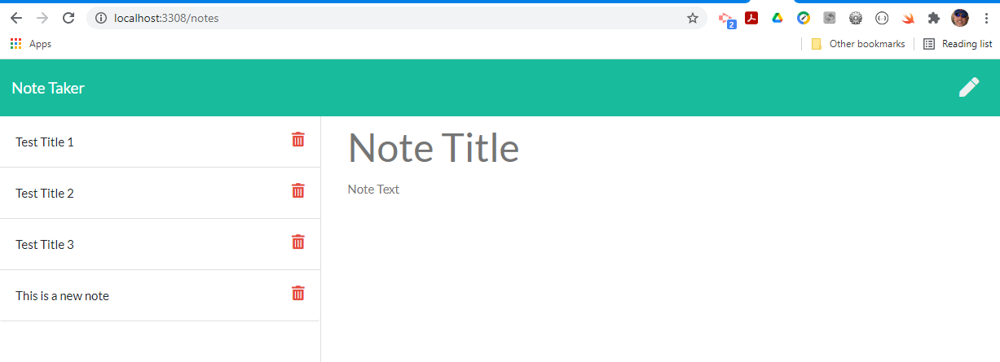

## Title: 11_Note_Taker

## Table of Contents
- [Description](#description)
- [Badges](#badges)
- [License](#license)
- [Installation](#installation)
- [Usage](#usage)
- [Contributing](#contributing)
- [Tests](#tests)
- [Questions](#questions)
- [Coding requriements](#languages)
- [Github reference](#github)

## Description
🔍 The assignment was to modify starter code to create an application called Note Taker that can be used to write and save notes. This application uses an Express.js back end and saves and retrieves note data from a JSON file.

The application’s front end was already created for this prject. It was my job to build the back end, connect the two, and then deploy the entire application to Heroku.

## Badges
🏆 Not applicable to this project.

## License
This program is not licensed

## Installation
💾 No installation instructions are needed for this application

## Usage
💻 This app is suited to manage notes by entering and deleting notes.

## Contributing
👪 Thank you for the support from Ronye and Rad during the class and after hours work!

## Tests
✏️ Testing was completed during the development phase. Any bugs or fault behaviour 

## Questions
If you should have questions, please contact me at tschmidt@eceglobal.com.
The same applies if you should find erros or bugs.
Thank you!

## Coding requirements
HTML 5.0, CSS, JavaScript, json, Bootstrap

## Github reference 
https://github.com/Thomas-NW/11_Note_Taker.git

Thank you for visiting and reviewing the project. 
---

